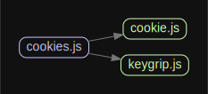

# 源码分析

通过app.keys来加解密cookie。多个key进行轮换密钥。

## 文件结构

``` bash
├── lib
|  ├── cookie.js - 单个cookie类，拼接cookie具体的字符串
|  ├── cookies.js - 对外入口，接收ctx和keys列表。基于cookie.js拼接单个cookie，基于kyegrip加解密
|  └── keygrip.js - 加密解密类，基于原生crypto模块


ignored: directory (1)

```

## 外部模块依赖

请在： http://npm.broofa.com?q=egg-cookies 查看

## 内部模块依赖



## 逐行文件分析

### cookies.js

对外入口，接收ctx和keys列表。
keys列表的为了轮换密钥，防止更换密钥后，客户端失效。
每个key对应的值基于keygrip.js来加密和解密。
每个具体的cookie基于cookie.js来承载。

### cookie.js

单个cookie类，拼接cookie具体的字符串

### keygrip.js

加密解密类，基于原生crypto模块。
解密时会多个key来进行尝试，防止更换key后客户端失效。


# egg-cookies

[![NPM version][npm-image]][npm-url]
[![build status][travis-image]][travis-url]
[![Test coverage][codecov-image]][codecov-url]
[![David deps][david-image]][david-url]
[![Known Vulnerabilities][snyk-image]][snyk-url]
[![npm download][download-image]][download-url]

[npm-image]: https://img.shields.io/npm/v/egg-cookies.svg?style=flat-square
[npm-url]: https://npmjs.org/package/egg-cookies
[travis-image]: https://img.shields.io/travis/eggjs/egg-cookies.svg?style=flat-square
[travis-url]: https://travis-ci.org/eggjs/egg-cookies
[codecov-image]: https://codecov.io/gh/eggjs/egg-cookies/branch/master/graph/badge.svg
[codecov-url]: https://codecov.io/gh/eggjs/egg-cookies
[david-image]: https://img.shields.io/david/eggjs/egg-cookies.svg?style=flat-square
[david-url]: https://david-dm.org/eggjs/egg-cookies
[snyk-image]: https://snyk.io/test/npm/egg-cookies/badge.svg?style=flat-square
[snyk-url]: https://snyk.io/test/npm/egg-cookies
[download-image]: https://img.shields.io/npm/dm/egg-cookies.svg?style=flat-square
[download-url]: https://npmjs.org/package/egg-cookies

Extends [pillarjs/cookies](https://github.com/pillarjs/cookies) to adapt koa and egg with some additional features.

## Encrypt

egg-cookies provide an alternative `encrypt` mode like `signed`. An encrypt cookie's value will be encrypted base on keys. Anyone who don't have the keys are unable to know the original cookie's value.

```js
const Cookies = require('egg-cookies');
const cookies = new Cookies(ctx, keys);

cookies.set('foo', 'bar', { encrypt: true });
cookies.get('foo', { encrypt: true });
```

**Note: you should both indicating in get and set in pairs.**

## Cookie Length Check

[Browsers all had some limitation in cookie's length](http://browsercookielimits.squawky.net/), so if set a cookie with an extremely long value(> 4093), egg-cookies will emit an `cookieLimitExceed` event. You can listen to this event and record.

```js
const Cookies = require('egg-cookies');
const cookies = new Cookies(ctx, keys);

cookies.on('cookieLimitExceed', { name, value } => {
  // log
});

cookies.set('foo', longText);
```

## License

[MIT](LICENSE.txt)
